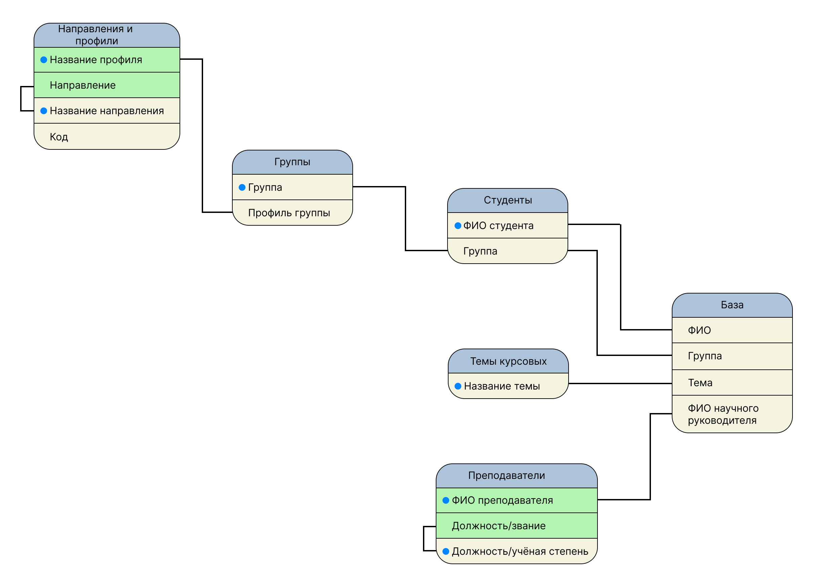
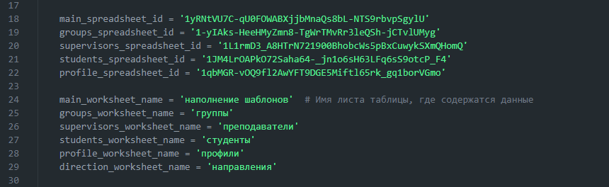
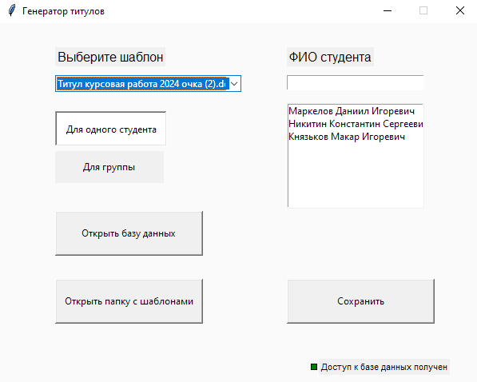
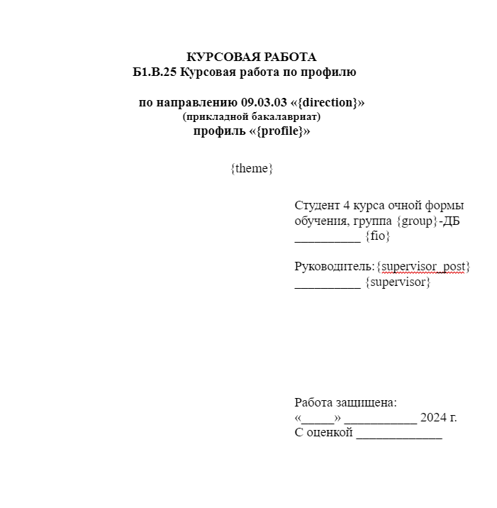

# Генератор титулов для документации студентов
### Приложение, созданное для упрощения процесса создания титульных листов. Оно предназначено как для преподавателей, так и для студентов.

# Подготовка к работе
## Создание базы данных на основе Google-таблиц
### Создаём таблицы так, чтобы итоговая схема таблиц выглядела следующим образом:

## Создание сервисного аккаунта и предоставление доступа к таблицам
### требуется создать сервисный аккаунт Google и настроить доступ к Google API, всё это осуществляется через консоль Google Cloud Platform. Вот основные шаги, которые требуется выполнить.
### 1. Создание проекта Google Cloud Platform.
 - Заходим в консоль Google Cloud Platform 
 - Создаём новый проект или выберите существующий.
### 2. Включение Google Drive API и Google Sheets API.
 - В панели навигации выбираем «APIs & Services» > «Library».
 - Находим и включаем необходимые Google Drive API и Google Sheets API.
### 3. Создание сервисного аккаунта.
 - В панели навигации выбираем «APIs & Services» > «Credentials».
 - Нажимаем «Create Credentials» и выбираем «Service Account».
 - Задаём имя сервисного аккаунта и необходимые роли доступа.
### 4. Создание и скачивание ключа.
 - После создания сервисного аккаунта, нажимаем «Add Key» > «Create New Key».
 - Выбираем тип ключа (например, JSON) и скачиваем файл с ключом.
### 5. Настройка доступа к файлам и документам.
 - Открываем Google Драйв и переходим к таблицам, к которым нужно предоставить доступ.
 - Нажимаем «Поделиться» и вводим адрес электронной почты вашего сервисного аккаунта.
 - Выбираем необходимые права доступа (редактирование)

### Полученный ключ(json-файл) нужно разместить в корневой папке приложения "credentials" и назвать "credd.json". Полный путь будет выглядеть "...\title_generator\credentials\credd.json".
### После завершения этих шагов приложение сможет использовать сервисный аккаунт для аутентификации и получения доступа к Google API, включая Google Drive API и Google Sheets API. Теперь можно встроить учетные данные сервисного аккаунта в код и взаимодействовать с файлами и документами Google Диска программным путем.

# Изменение ссылок на таблицы в коде
### Поскольку приложение ещё не до конца готово, то для получения данных из таблиц потребуется вручную указать ID таблиц и название нужных листов.

# Использование приложения
### После запуска приложения, если всё выше перечисленное было сделано правильно, то перед вами отобразится следующий интерфейс:

### Также перед началом работы вам нужно будет создать шаблоны подобные данному примеру(шаблоны обязательно должны быть .docx разрешения):

### Нужно заменить текст, который должен быть изменён в шаблоне на ключи. На данный момент добавлено 8 ключей:
 - {fio} - ФИО студента
 - {group} - группа студента
 - {supervisor} - ФИО научного руководителя
 - {supervisor_post} - звание научного руководителя
 - {profile} - профиль обучения студента
 - {direction} - направление обучения студента
 - {code} - код направления, на котором обучается студент
### После нужно разместить полученный шаблон в папку "templates", которая находится в корневой папке приложения по пути "...\title_generator\templates", или вы можете нажать кнопку "Открыть папку с шаблонами" прямо в приложении.
### Теперь приложение полностью готово к использованию.
### 1. После запуска приложения вам нужно будет выбрать нужный шаблон.
### 2. Затем выбрать режим "Для одного студента"(включен по умолчанию) или "Для группы".
### 3. После чего найти и выбрать нужного студента/группу и надать кнопку "Сохранить".
### 4. Далее, во всплывшем окне, вам нужно выбрать путь сохранения файла/файлов, написать название для файла и нажать сохранить(даже если выбран групповой режим нужно написать любое название).
### 5. Готово! После ожидания должно появиться уведомление о том что ваш файл/файлы сохранены.

### Приятного пользования!